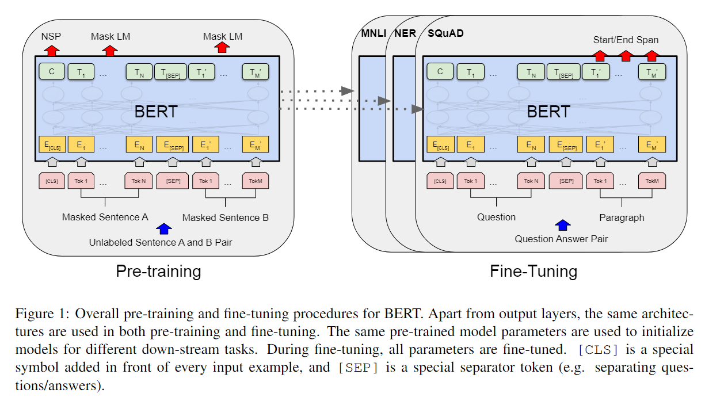
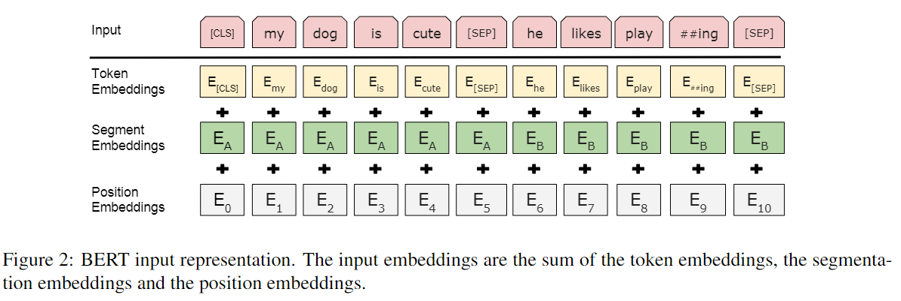
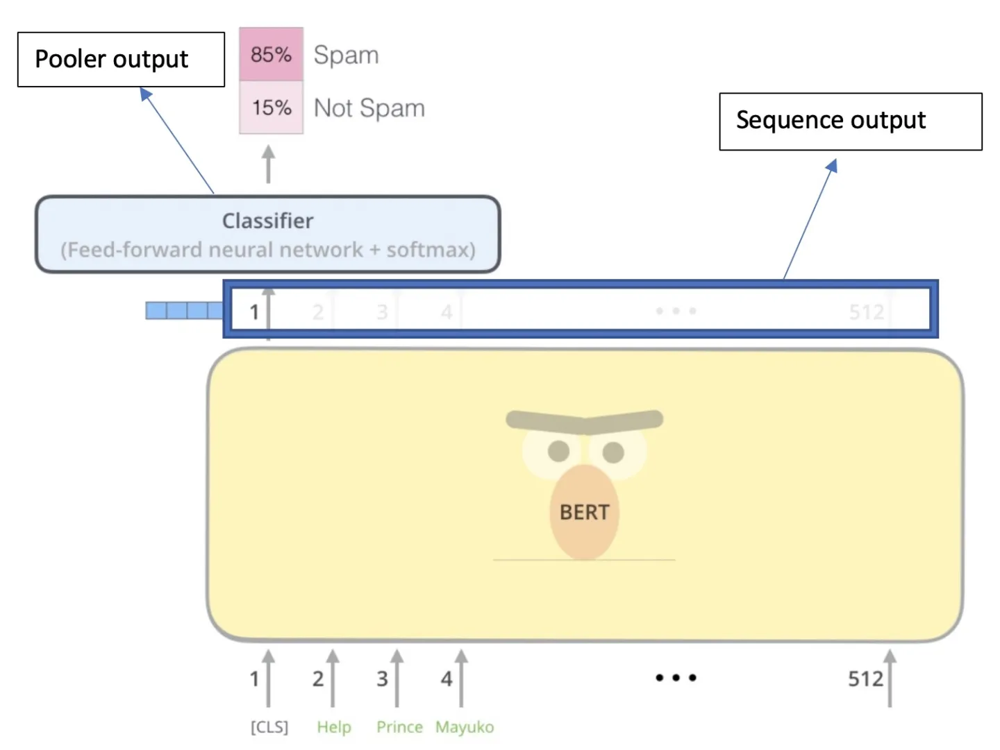

# BERT

> 借鉴李沐老师的BERT解读视频

常见的NLP有两种粒度的任务

- sentence-level（粗粒度）：对于句子的情绪识别这种任务

- token-level（细粒度）：实体关系抽取这种任务

BERT通过Pretraining的两个任务实现了sentence 和token层面都取得了很好的效果，通过Pretraining -> finetuneing，在11个NLP任务取得了SOTA。同时，BERT及其后续工作证明了大量的未标签的数据训练的模型效果大于在有标签的小数据训练

现有的使用Pretraining模型的方法有两种策略：

1. feature-based：ELMo（RNN based），把Pretraining的模型的输出作为额外的输入加进去
2. fine-tuning：BERT（Transformer based），对特定任务进行微调

## 实现细节

BERT模型由两个步骤组成：Pretraining + finetuneing

针对每一个下游任务，都会finetunning出一个新的BERT模型

### 模型架构

BERT使用原始的Transformer，主要调整了三个参数：

- the number of layers -> $L$
- the hidden size -> $H$
- the number of heads -> $A$

$BERT_{base}$ (L=12,H=728,A=12,Parameters=110M)

$BERT_{Large}$ (L=24,H=1024,A=16,Parameters=340M)

### 数据处理

#### 输入Embedding

输入层由三层Embedding组成：Token Embedding+Segment Embedding+Position Embeddings

- Token Embedding：使用WordPiece将每个词转换为固定维度的向量表示，WordPiece是一个数据驱动式的tokenization方法，旨在权衡词典大小和oov词的个数。这种方法把例子中的“strawberries”切分成了“straw” 和“berries”（拆成词根表示）。使用WordPiece 让BERT在处理英文文本的时候仅需要存储30,522 个词，而且很少遇到oov的词。
- Segment Embedding：用于区分Token Embedding所在的句段，例如B是否是A的下文（对话场景，问答场景等）。对于句子对，前一个句子的每个token都用0表示，后一个句子的每个token都用1表示。如”[CLS] my dog is cute [SEP] he likes play ##ing [SEP]“ 表示成”0 0 0 0 0 0 1 1 1 1 1“。 如果输入仅仅只有一个句子，那么它的segment embedding就是全0。 这也是一个(11, 768)维的向量。（如果不使用，可以全默认为0）
- Position Embedding：将单词的位置信息编码成特征向量，位置嵌入是向模型中引入单词位置关系的至关重要的一环。Note: BERT的位置编码是学习出来的，和相应位置上的词向量进行相加而不是拼接。

图中的两个特殊符号[CLS]和[SEP]，其中[CLS]表示该特征用于分类模型，对非分类模型，该符合可以省去。[SEP]表示分句符号，用于断开输入语料中的两个句子。除此之外，BERT对于语料的选取很关键，要选用document-level的而不是sentence-level的，这样可以具备抽象连续长序列特征的能力。

> 什么是document-level

#### 输出

BERT的输出可以分为两部分：一个是pooler output，对应的[CLS]的输出，以及sequence output，对应的是序列中的所有字的最后一层hidden输出。所以BERT主要可以处理两种，一种任务是分类/回归任务（使用的是pooler output），一种是序列任务（sequence output）。

> [CLS]这个token为什么不使用任意一个token去表示呢？如果都去做了交互的话

### Pretraining

1. masked language model（MIM） (受到Cloze启发)
   - 对输入的token进行随机mask，替换成$[Mask]$，目标函数是预测这些词（完形填空）（token level）
   - Mask的比例是WordPiece数据处理后的15%，但Mask后的数据和finetune的数据不匹配，因为[MASK] token在finetuning期间不会出现。为了缓解这种情况，对于我们mask的15%数据，我们将第 i 个token替换为 (1) 80%  [MASK] token (2) 10% 的随机token (3) 10% 不做任何更改。这么做的原因是如果句子中的某个Token100%都会被mask掉，那么在fine-tuning的时候模型就会有一些没有见过的单词。加入随机Token的原因是因为Transformer要保持对每个输入token的分布式表征，否则模型就会记住这个[mask]是token ’hairy‘，随机词替换会给模型增加一点点噪声，但是因为此时模型不知道哪个词是被随机换了(不像[MASK]，给模型[MASK]则模型知道此处词的是被挖了，他需要预测这个位置是啥)，所以就迫使他去更好地保留每个词的词义，为下游任务提供方便。至于单词带来的负面影响，因为一个单词被随机替换掉的概率只有15%*10% =1.5%，这个负面影响其实是可以忽略不计的。另外文章指出每次只预测15%的单词，因此模型收敛的比较慢。如下示例
     - 80%：`my dog is hairy -> my dog is [mask]`
     - 10%：`my dog is hairy -> my dog is apple`
     - 10%：`my dog is hairy -> my dog is hairy`
   - 因为是双向的语言模型，就不能使用预测下一个词的方式了

2. next sentence prediction

   - 给定两个句子，判断是否是相邻的（sentence level）
   - 具体来说：50%的概率，句子A和句子B是来自同一个文档的上下句, 50%的概率，句子A和句子B不是同一个文档的上下句

3. BERT的损失函数

   

## 优缺点

### 优点

- 效果好，横扫了11项NLP任务。bert之后基本全面拥抱transformer。微调下游任务的时候，即使数据集非常小（比如小于5000个标注样本），模型性能也有不错的提升。

### 缺点

作者在文中主要提到的就是MLM预训练时的mask问题：

- [MASK]标记在实际预测中不会出现，训练时用过多[MASK]影响模型表现
- 每个batch只有15%的token被预测，所以BERT收敛得比left-to-right模型要慢（它们会预测每个token）
- BERT的预训练任务MLM使得能够借助上下文对序列进行编码，但同时也使得其预训练过程与中的数据与微调的数据不匹配，难以适应生成式任务
- BERT没有考虑预测[MASK]之间的相关性，是对语言模型联合概率的有偏估计
- 由于最大输入长度的限制，适合句子和段落级别的任务，不适用于文档级别的任务（如长文本分类）

## 参考链接

1. https://blog.csdn.net/pipisorry/article/details/84951508
2. https://zhuanlan.zhihu.com/p/132554155
3. https://www.cnblogs.com/zingp/p/13849679.html
4. https://jalammar.github.io/a-visual-guide-to-using-bert-for-the-first-time/